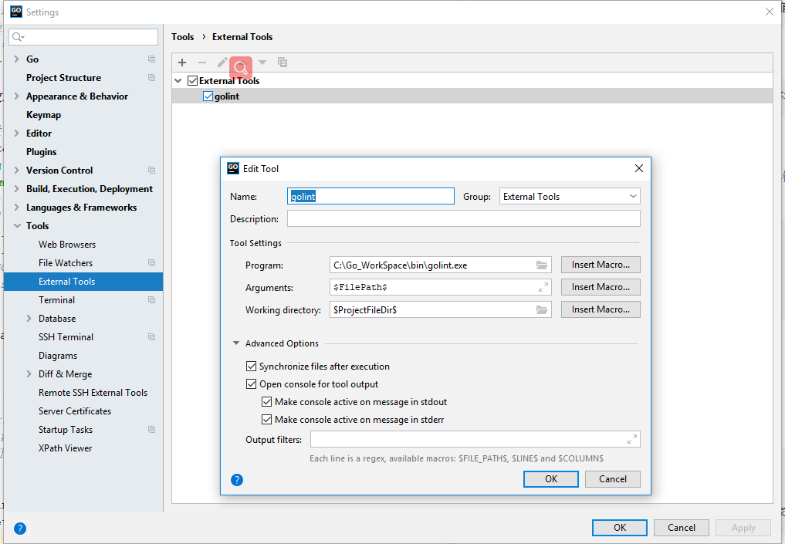
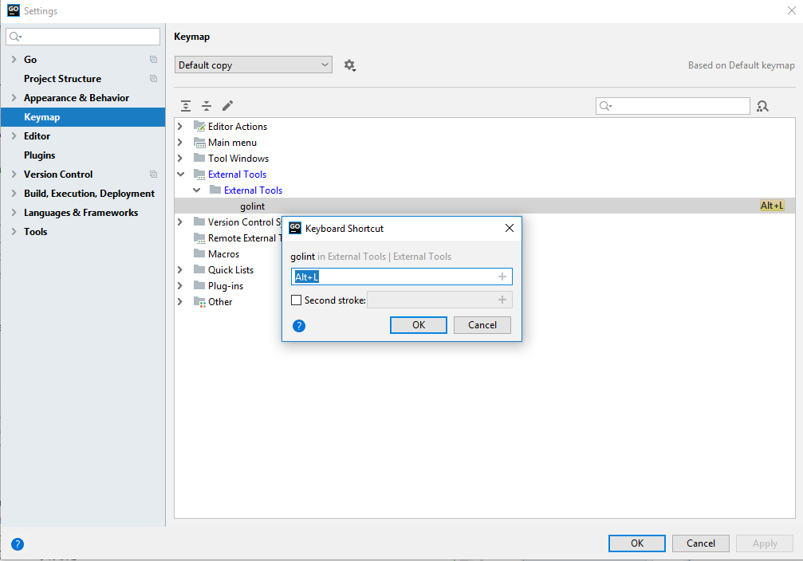
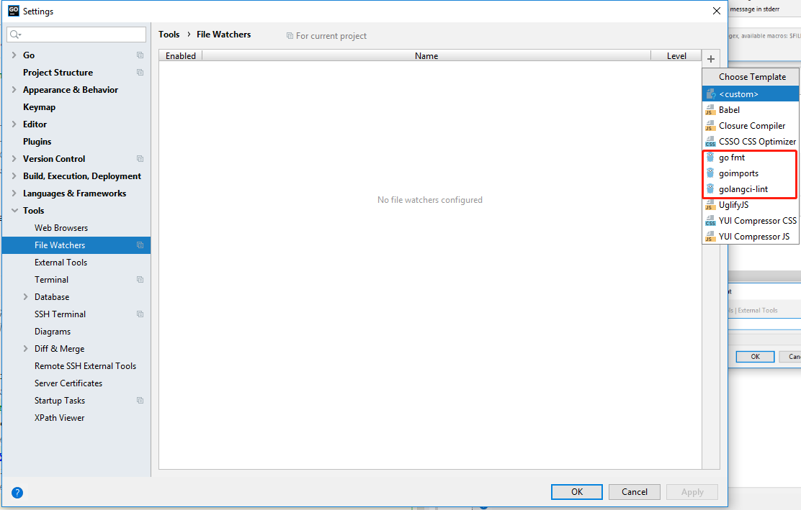
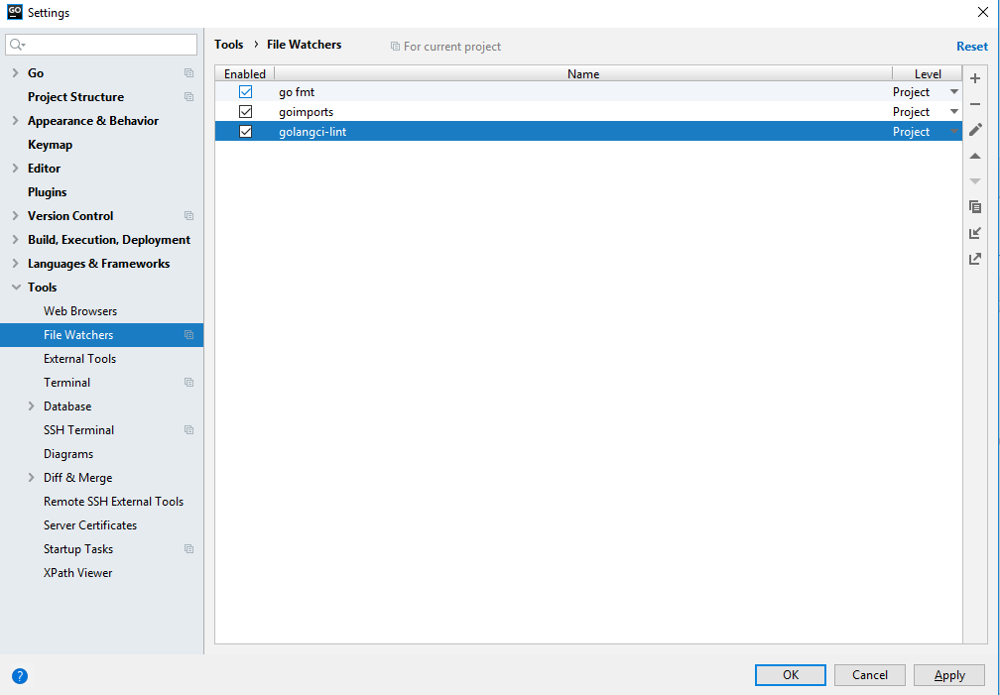

# GO-L
## 目录
* [安装](#SetUp)
* [安装Goland](#Goland)

<h1 id="SetUp">开发环境安装</h1>  

#### 1. windows/ 下载安装包并安装  
从官网https://golang.org/（需科学上网）或https://golang.google.cn/（镜像）下载windows安装包 如go1.12.7.windows-amd64.msi。
      双击安装包进行安装，默认安装至路径C:\Go\下。  
      
        安装包自动在【环境变量】中添加如下【系统变量】：  
        1. GOROOT，值为C:\Go\
        2. Path，追加;C:\Go\bin
        
        安装包自动在【环境变量】中添加如下【用户变量】：
        1. GOPATH，值为%USERPROFILE%\go
        2. Path，追加;%GOPATH%\bin
        
        备注：
        1. 环境变量查看方法如下：
        右键单击【我的电脑】->【属性】，选择【高级系统设置】->【高级】，点击【环境变量】
        2. %USERPROFILE%值
        在命令窗口（cmd）中输入`echo %USERPROFILE%`，可以获取值，如C:\Users\Administrator
        
#### 2. 修改工作路径环境变量  

        假设你以后编写go代码的工作路径为D:\go-work，则找到【环境变量】->【用户变量】中的GOPATH，修改其值为D:\go-work
#### 3.克隆tools、lint代码库  
> 由于golang.org在国内被屏蔽，可以从github.com下载其镜像。  
方法如下：在cmd中输入:  
```   mkdir %GOPATH%\src\golang.org\x
      cd /d %GOPATH%\src\golang.org\x
      git clone https://github.com/golang/tools
      git clone https://github.com/golang/lint
      cd %GOPATH%\src 
      go install golang.org/x/lint
 ``` 

<h1 id="Goland">安装Goland</h1>  

### 1. 安装
    
        1. 下载并安装  
        地址：https://www.jetbrains.com/go/?fromMenu  
        2. 注册Goland  
        ~~可以在某宝买到注册码，25软妹即可 拥有jetbrains 全家桶，亲测好用。~~

### 2. 设置  
> 1. **添加External Tools Golint**  
 ```File > Settings > Tools > External Tools```  

> 2. **设置Go lint 快捷键**  
```File > Settings > Keymap``` 
  
> 3. **设置File Watches**  
```File > Settings > Tools > File Watchers```  



    **Go lint 简介：https://github.com/golang/lint**  